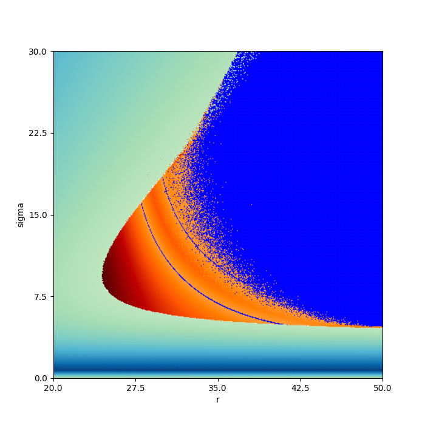

# Doubled Lorenz
## Diagrams
### 1
#### Params
skip_time = 0\
skip_time_to_normalization = 10\
integrate time = 20000\
samples = 4000\
step = 0.001\
param sigma = [20, 30, 400]\
param r = [20, 50, 400]\
b, delta, Mc = 8/3, 0, 1\
initial_point = [1e-150, 0...]\
TIME_FOR_CALC = 6 hours 33 minutes\
DATE = 26.09.24 21:51\
Treshhold zero lyap = 0.001\
Treshhold zero angle = 0.001
#### Pic

### 2
#### Params
method -- VAR\
skip_time = 0\
skip_time_to_normalization = 10\
integrate time = 40000\
samples = 8000\
step = 0.001\
param alpha = [20, 50, 400]\
param r = [0, 30, 400]\
b, delta, Mc = 8/3, 0, 1\
initial_point = [1e-150, 0...]\
TIME_FOR_CALC = 13 hours 5 minutes\
DATE = 27.09.24 23:44\
Treshhold zero lyap = 0.001\
Treshhold zero angle = 0.001
#### Pic
