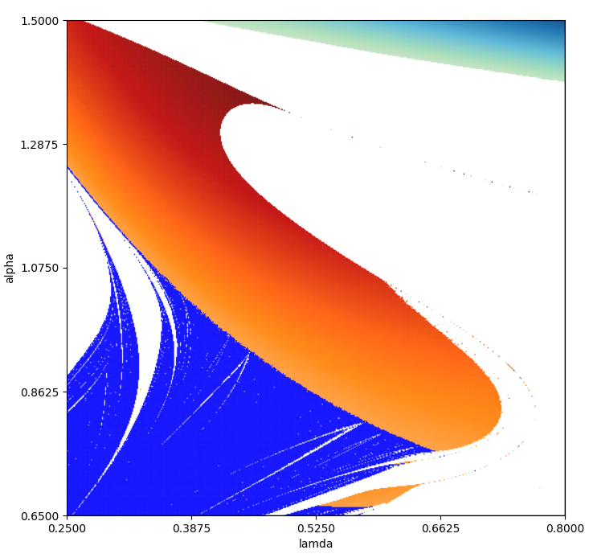
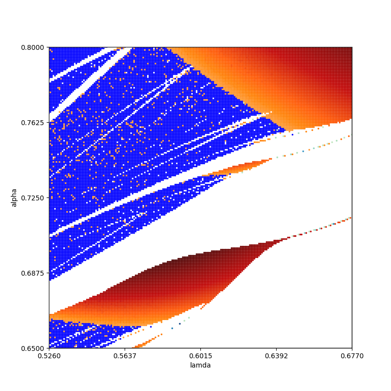
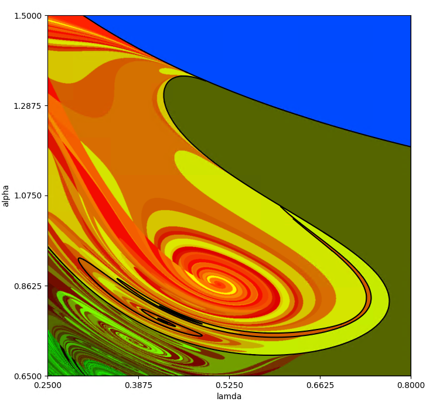
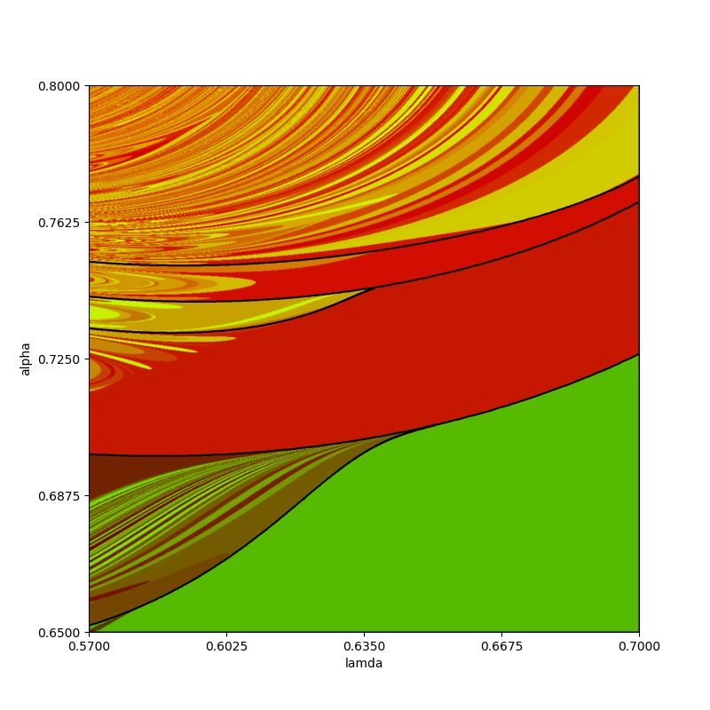
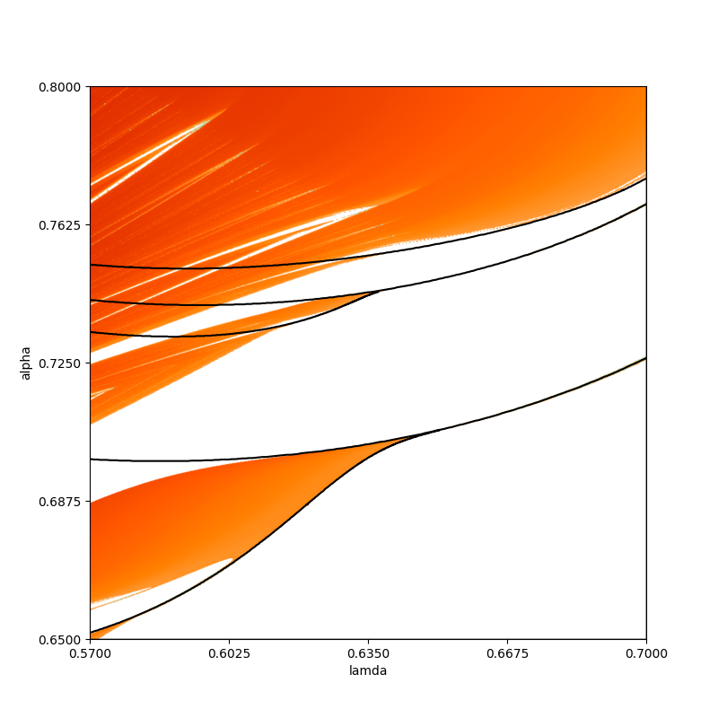

# Shimizu3X
## Diagrams

### 1
#### Params
method -- VAR\
skip_time = 1000\
skip_time_to_normalization = 30\
integrate time = 10000\
samples = 1000\
step = 0.01\
param alpha = [0.65, 1.5, 500]\
param r = [0.25, 0.8, 500]\
B = 0.2\
initial_point = [0.00000001, 0 * 2]\
TIME_FOR_CALC = \
DATE = 11.10.24 11:59\
Treshhold zero lyap = 0.001\
Treshhold zero angle = 0.01
#### Pic

### 2
#### Params
method -- VAR\
skip_time = 1000\
skip_time_to_normalization = 50\
integrate time = 10000\
samples = 1000\
step = 0.01\
param alpha = [0.65, 0.8, 200]\
param r = [0.526, 0.677, 200]\
B = 0.2\
initial_point = [0.001 * 3]\
TIME_FOR_CALC = \
DATE = 14.09.24 12:20\
Treshhold zero lyap = 0.001\
Treshhold zero angle = 0.001
#### Pic

### 3
#### Params
method -- Kneadings\
loc mistake = 1e-10\
global mistake = 1e-10\
lenght = 12\
step = 0.01\
param alpha = [0.65, 1.5, 1000]\
param r = [0.25, 0.8, 1000]\
B = 0.2\
DATE = 21.09.24 15:13\
#### Pic

### 4
#### Params
method -- Kneadings\
loc mistake = 1e-10\
global mistake = 1e-10\
lenght = 24\
step = 0.01\
param alpha = [0.65, 0.8, 1000]\
param r = [0.57, 0.7, 1000]\
B = 0.2\
DATE = 11.10.24 23:58\
#### Pic

### 5
#### Params
method -- slave Lyap\
skip_time = 1000\
skip_time_to_normalization = 50\
integrate time = 10000\
step = 0.01\
param alpha = [0.65, 1.5, 1000]\
param r = [0.25, 0.8, 1000]\
B = 0.2\
initial_point = [0.001 * 3]\
TIME_FOR_CALC = 1000\
DATE = 08.10.24 14:14\
Treshhold zero lyap = 0.002\
#### Pic

### 6
#### Params
method -- slave Lyap\
skip_time = 1000\
skip_time_to_normalization = 50\
integrate time = 10000\
step = 0.01\
param alpha = [0.65, 0.8, 1000]\
param r = [0.57, 0.7, 1000]\
B = 0.2\
initial_point = [0.001 * 3]\
TIME_FOR_CALC = 1000\
DATE = 11.10.24 13:09\
Treshhold zero lyap = 0.002\
#### Pic
