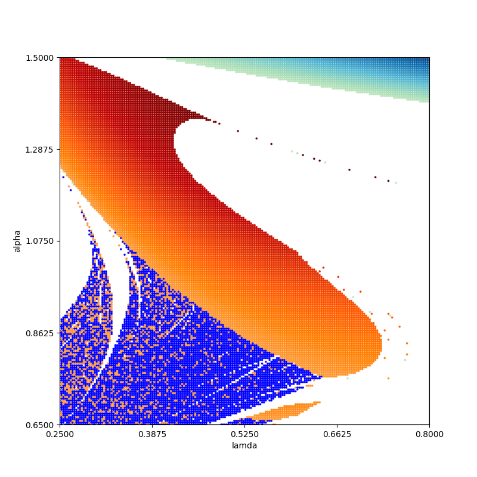
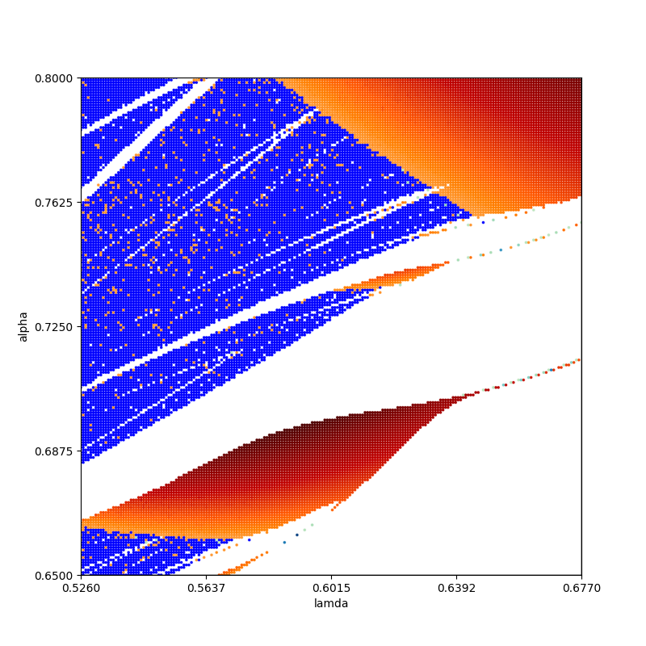

# Shimizu3X
## Diagrams
### 1
#### Params
method -- VAR\
skip_time = 1000\
skip_time_to_normalization = 50\
integrate time = 10000\
samples = 1000\
step = 0.01\
param alpha = [0.65, 1.5, 200]\
param r = [0.25, 0.8, 200]\
B = 0.2\
initial_point = [0.001 * 3]\
TIME_FOR_CALC = \
DATE = 14.09.24 11:59\
Treshhold zero lyap = 0.001\
Treshhold zero angle = 0.001
#### Pic

### 2
#### Params
method -- VAR\
skip_time = 1000\
skip_time_to_normalization = 50\
integrate time = 10000\
samples = 1000\
step = 0.01\
param alpha = [0.65, 0.8, 200]\
param r = [0.526, 0.677, 200]\
B = 0.2\
initial_point = [0.001 * 3]\
TIME_FOR_CALC = \
DATE = 14.09.24 12:20\
Treshhold zero lyap = 0.001\
Treshhold zero angle = 0.001
#### Pic
